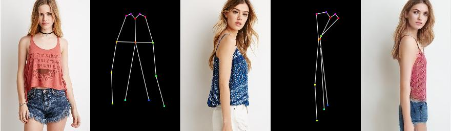

# DeepFashion.ADGAN

## Описание
Пользователи интернет-магазинов одежды делают выбор на основе представленных картинок товаров на сайте магазина. Заполнением фотографий товара занимается фотостудия магазина (in-house или outsource) и это не бесплатно. Кол-во и качество фотографий напрямую зависят от маржи магазина и влияют на конечную цену товара.
Понятно, что крупные магазины могут позволить себе внутренние фотостудии с приглашенными моделями (включая отделы ретуши и постпродакшн) и могут позволить себе качественные фото на карточках товара. Тогда как остальные магазины довольствуются фотографиями представленные брендом и/или из интернета. В этом случае фото расходится между сайтами магазинов работающими в одном сегменте (конкурентами) и как правило “замыливаются” потенциальному покупателю.

Итого имеем следующую ситуацию:
> Крупные магазины имеют уникальные фотографии товаров на сайте
> Остальные магазины используют фото предоставленные брендом или из интернета (не уникальные)
> Причем в обоих случаях возможна ситуация когда фотография представлена не в самом выгодном свете (ракурсе) с точки зрения потенциального покупателя. Т.е. с точки зрения фотографа композиция выстроена в выгодном положении, однако клиент хочет увидеть товар под другим углом или в другом окружении или комбинации. Например блузку с юбкой, а не джинсами как на сайте. Кроме того, фотографии брендов (особенно международных западных) могут быть сделаны на моделях другой этнической группы не всегда близкой покупателю.

## Задачи
Необходимо персонализировать карточку товара для покупателя. Дать возможность посмотреть на товар “на себе” в своей позе. Приблизить восприятие товара в реальном мире. Всем покупателям понятно что одежда на “идеальных” моделях и реальном покупателе будут выглядеть совершенно по разному. Поэтому предлагается следующее.
Дать возможность потенциальному покупателю загрузить свою фотографию на сайт или моб приложение и получить карточку товара со своим изображением в произвольной позе (взятой из загруженного фото или фотографии модели). Целевую задачу можно разбить на несколько этапов. 1. По фотографии пользователя определить позу и сгенерировать фото товара+модели в позе покупателя. 2. По набору фотографий пользователя (реперные точки) определить рост+размер покупателя и далее одеть весь ассортимент магазина на покупателя. Т.е. покупатель будет видеть все товары конкретно “на себе”

## План-график

|Scope|Результат|Срок|
|-----|---------|----|
|п.0. | Освоить перенос стиля, управление генерацией изображение с помощью Latent Codes Домашнее задание по GAN+Style Transfer+GAN with Latent codes | Домашнее задание по GAN|
|п.1. | по фотографии пользователя определить позу и сгенерировать фото товара+модели в позе покупателя Веб сервис возвращает фото модели в товаре из карточки товара в позах покупателя |Финальный проект DLS 2020 #1|
|п.2. | по набору реперных фото покупателя одеть весь ассортимент магазина в покупателя Сайт магазина представляет пользователю весь ассортимент (карточки товаров) “на покупателе” фото лица и размеры покупателя |TBD|

## Участники

|Роль |ФИО |Контакты telegram|
|-----|----|-----------------|
|Исполнитель этапа 1|Гольдяев Сергей|@sgoldyaev|
|Куратор этапа 1|Яровиков Юрий|@yu_rovikov|		
|Куратор этапа 2|||		

## TODO

|Наименование|Текущий статус|
|------------|--------------|
|Vanila GAN|Done|
|InfoGAN|Done|
|Style Transfer|Done|
|Human Pose (18 keypoints with heatmap)|Done|	
|Instance segmentation (<8 layers)|Poor|	
|HiRes GAN|None|
|Inference Style Codes|None|

## Datasets

|Название|Paper|Downloads|
|--------|-----|---------|
|MS COCO||http://cocodataset.org|
|DensePose-COCO|https://arxiv.org/abs/1802.00434|http://densepose.org|
|Market-1501|https://ieeexplore.ieee.org/document/7410490,https://www.cv-foundation.org/openaccess/content_iccv_2015/papers/Zheng_Scalable_Person_Re-Identification_ICCV_2015_paper.pdf,https://paperswithcode.com/sota/person-re-identification-on-market-1501|https://kaiyangzhou.github.io/deep-person-reid/datasets.html#market1501-dagger-market1501|
|DukeMTMC-reID|https://arxiv.org/abs/1912.11630|https://kaiyangzhou.github.io/deep-person-reid/datasets.html#dukemtmc-reid-dagger-dukemtmcreid|
|DeepFashion|https://ieeexplore.ieee.org/document/7780493|http://mmlab.ie.cuhk.edu.hk/projects/DeepFashion.html|

## Архитектура 
https://arxiv.org/pdf/1705.09368.pdf Базовая архитектура

https://arxiv.org/pdf/2003.12267.pdf Имплементированная архитектура

## Результаты

Модель из данной работы была обучена на DeepFashion Datset. Приложенные веса оказались необучены и модель выдавала такие результаты.

После обучениия на 80 эпохах результат стал заметно лучше, в целевой картинке легко угадываются поза и перенесенные атрибуты.

Встал вопрос, можно ли эту модель использовать для новых данных (не из датасета). Почти сразу выяснилось, что в исходниках отсутствует компонент отвечающий за segmentation map - карта с размеченными сегментами. Без проблем добавлен предобученный torchvision.models.detection.maskrcnn_resnet50_fpn. И получен мгновенный результат.

И тут выяснилось что уровень сегментации из maskrcnn_resnet50_fpn для подобной задачи не подходит. Вот так выглядит segmentation map из набора размеченных данных DeepFashion Dataset и вычисленный maskrcnn_resnet50 (всего один слой, prediction > 0.7). Понятно что в таком случае перед моделью встанет задача переноса ровно одного стиля (человека+волос+одежды и т.д.). Необходимо срочно решить задачу instance segmentation.

Занятно другое, если обучить модель до 400 эпох (напомню пред результаты мы смотрели на 80 эпохах), то результат будет вполне приемлимым даже при наличии 1 segmentation mask. 

Для сравнения, вот так выглядит перенос стиля при наличии 8 segmentation masks на моделе обученной до 400 эпох.

Так же анализ результатов показывает в каких случаях получается хороший и плохой результат.
|Плохо|Картинка|
|-----|--------|
|Если в исходной картинке пристуствует только часть позы от целевой картинки. Т.к. модель просто не знает откуда брать||
|Тоже самое справедливо и "вид со спины".||
|Совсем плохие результаты получаются с замысловатыми позами или где руки скрыты за телом.||
|Плохо переносятся сложные рисунки на одежде.||

Есть и положительные кейсы
|Хорошо|Картинка|
|------|--------|
|Если в исходной картинке количество pose keypoints больше или не меньше чем в целевой ||
|Хорошо переносится одежда с простыми принтами||

To be continue ...
